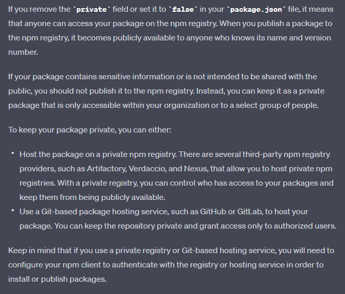

## Standalone react component to use as a library

###  Introduction
Using Webpack, The React component is bundled and using babel, it will usable in browser.
And after publishing to npm, it can used as a library only including the js from unpckg source

### How to run

`npm start` 
[entry point is index.js]

### How to publish
1. Update version in Package.json
2. Push the changes to main branch
3. Run
    `npm run prepublishOnly
     npm publish`

### How to use
````
        <script src="https://unpkg.com/react-standalone-library/dist/my-component.min.js"></script>
        <script>
        
          function onLoad() {
            var myComponent = new MessageCount.default({
              message: 'React standalone demo!!',
              container: document.getElementById('my-component-container'),
            })
            console.log(myComponent)
          }
        </script>

````

#### Demo
`https://unpkg.com/react-standalone-library/dist/index.html`

### Point of Discussion
 